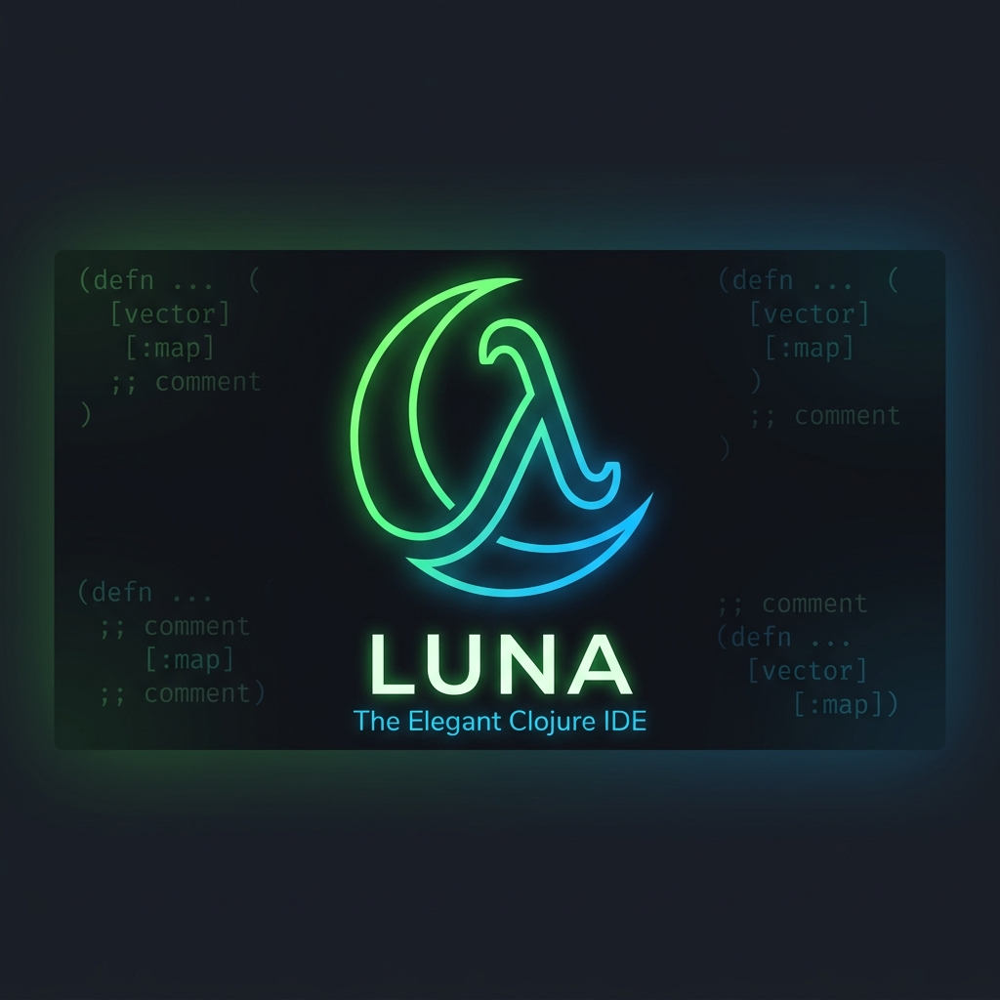

[](https://github.com/juv4uk/Clojure-code/actions/workflows/release.yml)
[](https://github.com/juv4uk/Clojure-code/releases/latest)


## Introduction

**Clojure-code** is a modernized fork of [Nightcode](https://github.com/oakes/Nightcode), a simple IDE for Clojure and ClojureScript. 
This version features updated dependencies, modern JavaFX, and targets Java 21 for significantly faster startup times and better performance.

## Installation

Go to the [Releases](https://github.com/juv4uk/Clojure-code/releases) page and download the appropriate `.jar` file for your operating system.
Run it with:
```bash
java -jar clojure-code-<os>.jar
```

## Development

* Install **JDK 21** or above
* Install [the Clojure CLI tool](https://clojure.org/guides/getting_started#_clojure_installer_and_cli_tools)
* To develop: `clj -M:dev`
* To build the ClojureScript files: `clj -M:cljs`
* To build the uberjar for each OS locally:
  * `clj -M:prod uberjar windows`
  * `clj -M:prod uberjar macos`
  * `clj -M:prod uberjar linux`

## Automated Releases

This project is configured with GitHub Actions. To publish a new release for all platforms:
1. Create a new tag (e.g. `v1.0.1`): `git tag -a v1.0.1 -m "Release 1.0.1"`
2. Push the tag: `git push origin v1.0.1`
3. GitHub Actions will automatically build the `.jar` files and attach them to a new GitHub Release.

## Licensing

All files that originate from this project are dedicated to the public domain. I would love pull requests, and will assume that they are also dedicated to the public domain.
